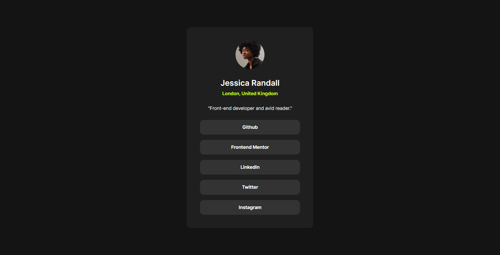

# Frontend Mentor - Social links profile solution

This is a solution to the [Social links profile challenge on Frontend Mentor](https://www.frontendmentor.io/challenges/social-links-profile-UG32l9m6dQ). Frontend Mentor challenges help you improve your coding skills by building realistic projects.

## Table of contents

- [Overview](#overview)
    - [The challenge](#the-challenge)
    - [Screenshot](#screenshot)
    - [Links](#links)
- [My process](#my-process)
    - [Built with](#built-with)
    - [What I learned](#what-i-learned)
    - [Useful resources](#useful-resources)
- [Author](#author)

## Overview

### The challenge

Users should be able to:

- See hover and focus states for all interactive elements on the page

### Screenshot

### Links

- Solution URL: [Solution](https://github.com/Nelo0o/social-links-profile?tab=readme-ov-file)
- Live Site URL: [Live site](https://nelo0o.github.io/social-links-profile)

## My process

- Step 1 : Write HTML5 with BEM method for class
- Step 2 : Write SCSS for styling

### Built with

- HTML5
- SCSS - CSS

### What I learned

I learned new SCSS Tricks

### Useful resources

- [Mozilla Developer Network](https://developer.mozilla.org/fr/) - The reference.
- [SASS](https://sass-lang.com/) - Banger.

## Author

- Website - [Léon Gallet](https://leon-gallet.fr)
- Frontend Mentor - [@Nelo0o](https://www.frontendmentor.io/profile/Nelo0o)
